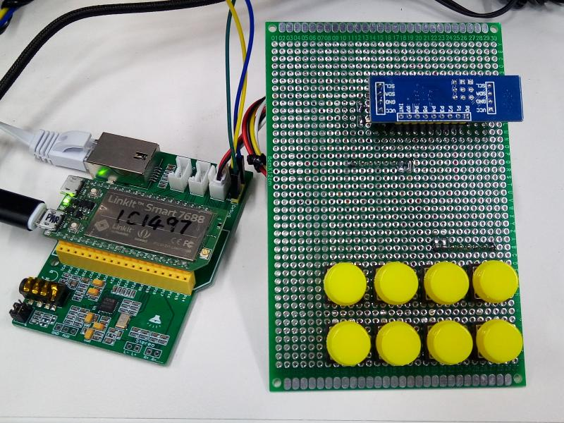

# Object : example of PCF8574 button proc driver

   

## Test HW: Linkit 7688
## Test SW: openwrit 3.18.109

# Usage:
	copy hello_btn to openwrt/package/kernel
	make menuconfig
		select
		Kernel modules
		Other modules
		[*]kmod-hello_btn
	make package/hello_eeprom/compile V=s
	opkg install ipk to Linkit 7688

	cat /proc/HELLO_BTN

# Note:
	The analog button seems simple. 
	But, after 1~3 years, the button maybe be damped and there is some resistance.
	One day, you want to press button to cancle launching missle. 
	But,bad button launches the missile XD
